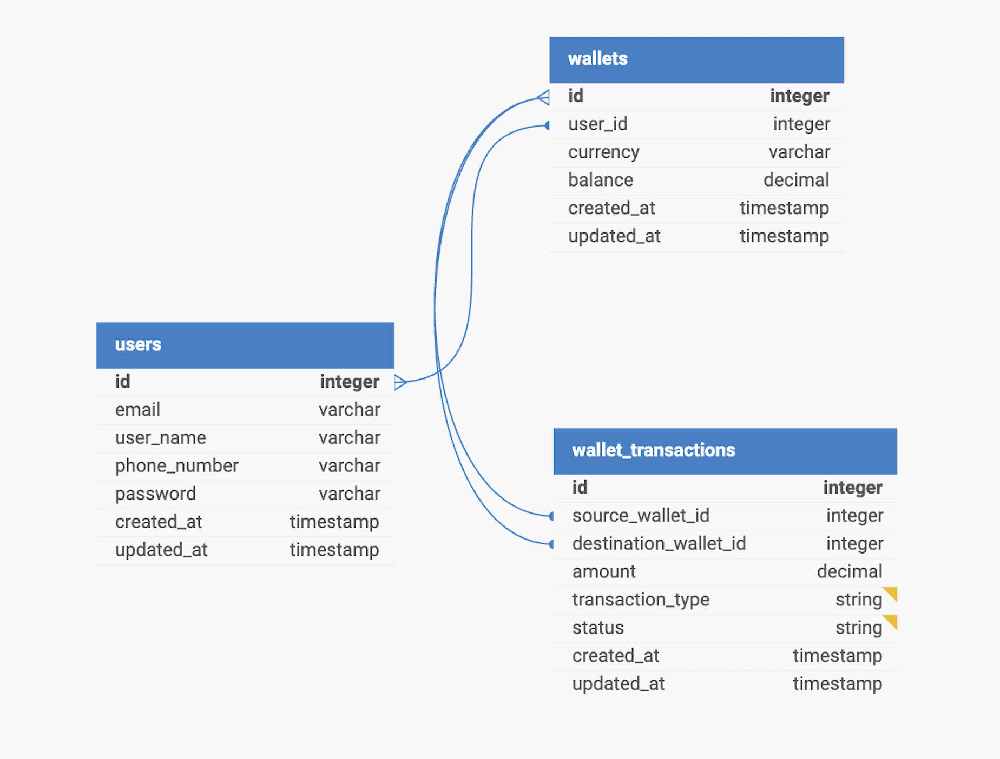

### demo-credit

> Demo Credit is a mobile lending app with wallet functionality for borrowers to receive loans and make repayments.

### Objective

Demo Credit is a mobile lending app that includes wallet functionality. Borrowers use the wallet to receive granted loans and make repayments.

### High Level Overview

- [Demo Credit Docs](https://www.notion.so/Demo-Credit-acb077a3a22141e7b3dc5e01c92b5158)

### Project Architecture

Overall, the project is designed to be scalable, maintainable and extensible. The use of a modular monolithic architecture, where all key features are modularized. This can easily spin off to a micro-service that easily promotes code organization and separation of concerns.

### E-R Diagram



### Features

- A user can create an account
- A user can fund their account
- A user can transfer funds to another user’s account
- A user can withdraw funds from their account.
- A user with records in the Lendsqr Adjutor [Karma blacklist](https://api.adjutor.io/) should never be onboarded

### Tech Stack

- Language: [TypeScript](https://www.typescriptlang.org/)
- Framework: [Express](https://expressjs.com/)
- Runtime: [Node.js](https://nodejs.org/en)
- KnexJS: [KnexJS](https://knexjs.org/)
- Database: [MySQL](https://www.mysql.com/)

### Setup (Application Requirements)

- [Docker](https://www.docker.com/)
- [Postman](https://www.postman.com/downloads/)
- [Git](https://git-scm.com/downloads)

- Create an Account and get Paystack API key from [Paystack API](https://paystack.com/gh/developers?q=/developers)
- Create an Account and get Ajutor API Secret key from [Adjutor API Key](https://app.adjutor.io/signup?source=adjutor-api-documentation)

### Installation 📦

```bash
   $ git clone https://github.com/sheygs/demo-credit.git
   $ cd backend
   $ npm install
```

- Rename`.env.dev` to `.env` and populate variables with `****`

### Migration

- Run `npm run migrate` to create tables.

### Using Docker (Recommended)

- Run `docker compose up -d`.
- Open browser and visit `http://localhost:8281`

### Test

```bash
   $ npm run test
```

### Postman Documentation

- Navigate to `http://localhost:8281/api-docs` to view the openapi documentation OR
- See `postman` folder in the root directory.

### Production API Endpoint

- Open browser and visit [Demo Credit Endpoint](https://olusegun-ekoh-lendsqr-be-test.up.railway.app) 🚀

### Video Demo

- [Demo Credit API Overview](https://www.loom.com/share/5eb098d6d12c443b98cda897d28d7db5?sid=c7230024-43b7-49f2-b7f3-05bac29ceec6)
